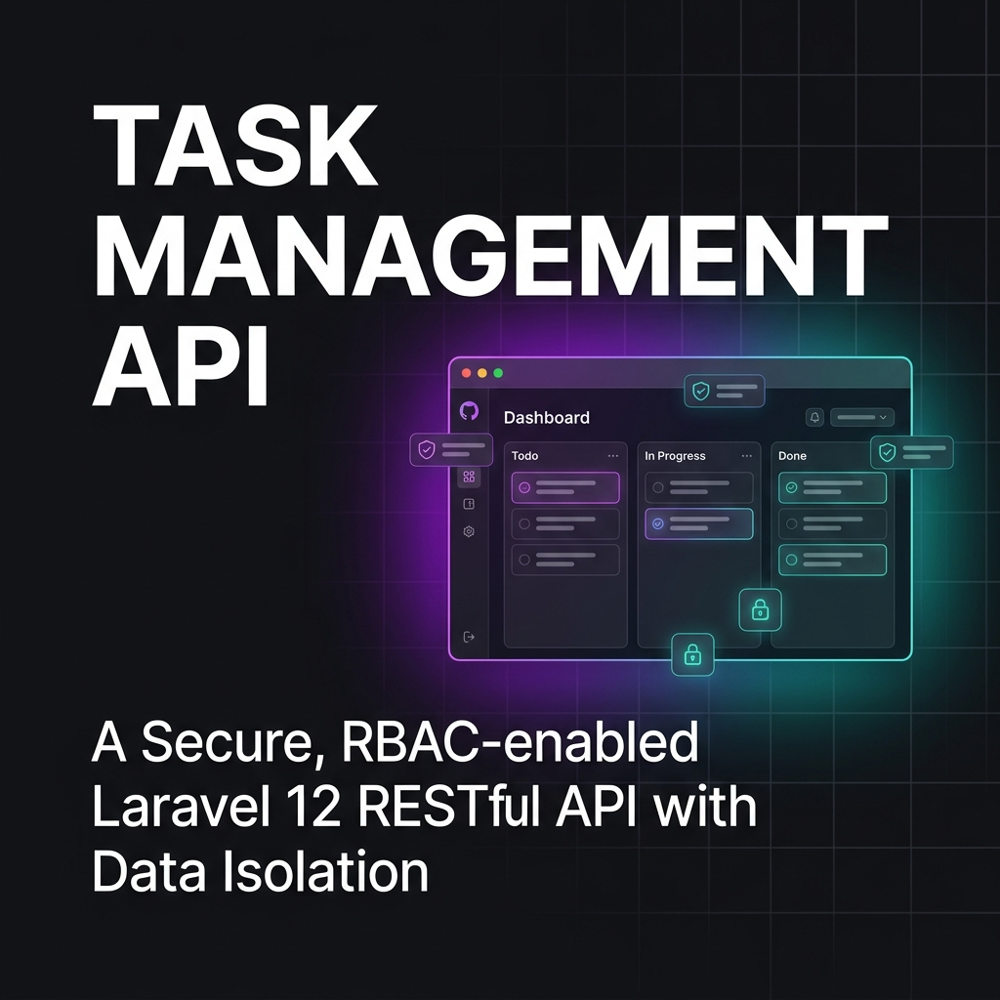

# Task Management API



Sistem manajemen tugas (Task Management) berbasis RESTful API yang dibangun dengan fokus pada keamanan data (**Data Isolation**), manajemen akses yang ketat (**RBAC**), dan arsitektur kode yang bersih (**Clean Architecture**) menggunakan **Service-Repository Pattern**.

---

## 🛠️ Tech Stack

- **Framework**: Laravel 12
- **Database**: MySQL
- **Authentication**: Laravel Sanctum
- **Authorization**: Spatie Laravel Permission
- **Architecture**: Service-Repository Pattern
- Dev Tools:
  - Prettier: Untuk konsistensi formatting kode (PHP & Blade).
  - Laravel IDE Helper: Untuk autocompletion & static analysis yang lebih baik.

---

## Installation & Setup

- Clone & Dependencies

```bash
git clone https://github.com/rizkikosasih/laravel-task-api.git nama-folder

cd nama-folder

composer install

npm install --save-dev prettier @prettier/plugin-php prettier-plugin-blade
```

- Environment & Keys

```bash
cp .env.example .env

php artisan key:generate
```

- Database & Security Seeder

```bash
php artisan migrate --seed
```

- IDE Optimization (Optional)

```bash
php artisan ide-helper:generate php artisan ide-helper:meta
```

- Run Application

```bash
php artisan serve
```

---

## 🚀 Fitur Utama

### 1. Authentication

Endpoint:

```
POST /api/auth/register
POST /api/auth/login
POST /api/auth/logout
GET /api/auth/me
```

Fungsi:

- registrasi user
- login menghasilkan **API token**
- logout revoke token
- melihat profil user

---

### 2. RBAC System

Role:

```
admin
member
```

Daftar Permission:

```
view project
create project
update project
delete project
view task
create task
update task detail
update task status
delete task
view comment
create comment
delete comment
```

---

#### **Matrix Otorisasi & Kontrol Akses (RBAC & ABAC)**

Sistem ini menerapkan kombinasi **Role-Based Access Control (RBAC)** untuk izin fitur secara global dan **Attribute-Based Access Control (ABAC)** untuk validasi kepemilikan data (Ownership).

| **Resource** | **Action**        | **Admin** | **Member** | **Penjelasan Logic**                                                       |
| ------------ | ----------------- | --------- | ---------- | -------------------------------------------------------------------------- |
| **Project**  | **Create**        | ✅        | ❌         | Semua Admin bisa buat Project.                                             |
|              | **View Detail**   | ✅        | ✅         | Admin bebas lihat. Member harus terlibat (punya task) di Project tersebut. |
|              | **Update/Delete** | ✅\*      | ❌         | \*Hanya Admin pembuat Project (**Owner**).                                 |
| **Task**     | **View List**     | ✅        | ✅         | Admin bebas lihat semua. Member hanya lihat task yang di-assign ke dia.    |
|              | **View Detail**   | ✅        | ✅         | Admin bebas lihat semua. Member hanya bisa lihat task miliknya.            |
|              | **Create**        | ✅\*      | ❌         | \*Hanya Admin pembuat Project (**Owner**).                                 |
|              | **Update Detail** | ✅\*      | ❌         | \*Hanya Admin pembuat Project (**Owner**).                                 |
|              | **Update Status** | ✅\*      | ✅         | \*Admin Owner ATAU Member yang di-assign ke task tersebut.                 |
|              | **Delete**        | ✅\*      | ❌         | \*Hanya Admin pembuat Project (**Owner**).                                 |
| **Comment**  | **View List**     | ✅        | ✅         | Terbuka bagi siapa saja yang punya akses ke Task tersebut.                 |
|              | **Create**        | ✅        | ✅         | Admin/Member yang terlibat di Task boleh kasih komentar.                   |
|              | **Delete**        | ✅\*      | ✅\*       | \*Hanya pemilik komentar (**Owner**) yang boleh hapus komennya.            |

---

### 3. Project Management

Endpoint:

```
GET /api/projects
POST /api/projects
GET /api/projects/{project}
PUT /api/projects/{project}
DELETE /api/projects/{project}
```

Field project:

```
id
name
description
created_by
created_at
updated_at
deleted_at
```

---

### 4. Task Management

Endpoint:

```
GET /api/tasks
POST /api/tasks
GET /api/tasks/{task}
PUT /api/tasks/{task}
DELETE /api/tasks/{task}
PATCH /api/tasks/{task}/status
```

Field task:

```
id
project_id
title
description
status
assigned_to
due_date
created_at
updated_at
deleted_at
```

Status task:

```
todo
in_progress
done
```

---

### 5. Comment System

Endpoint:

```
GET /api/tasks/{task}/comments
POST /api/tasks/{task}/comments
DELETE /api/comments/{comment}
```

Field:

```
id
task_id
user_id
message
created_at
updated_at
deleted_at
```

---

### 6. Pagination & Filtering

Contoh:

```
GET /api/projects?page=1&per_page=10&search=qwerty
GET /api/tasks?status=todo&project_id=1&assigned_to=1&search=test&page=1&per_page=10
```

---

### 7. Technical Excellence

- **Service-Repository Pattern**: Memisahkan logika bisnis dari akses database untuk meningkatkan _maintainability_ dan mempermudah unit testing.
- **Policy-Driven Authorization**: Menggunakan Laravel Policy secara menyeluruh untuk menangani otorisasi yang granular.
- **Conventional Commits**: Menggunakan standar pesan commit yang rapi untuk histori pengembangan yang profesional.

---

## Struktur Database

### users

```
id
name
email
email_verified_at
password
remember_token
created_at
updated_at
deleted_at
```

---

### projects

```
id
name
description
created_by
created_at
updated_at
deleted_at
```

---

### tasks

```
id
project_id
title
description
status
assigned_to
due_date
created_at
updated_at
deleted_at
```

---

### comments

```
id
task_id
user_id
message
created_at
updated_at
deleted_at
```

---

## Struktur Folder

```
app/
 ├── Http/
 │    ├── Controllers/
 │    ├── Requests/
 │    └── Resources/
 │
 ├── Services/
 │    ├── AuthService.php
 │    ├── ProjectService.php
 │    ├── TaskService.php
 │    └── CommentService.php
 │
 ├── Repositories/
 │    ├── Contracts/
 │    │     ├── ProjectRepositoryInterface.php
 │    │     ├── TaskRepositoryInterface.php
 │    │     └── CommentRepositoryInterface.php
 │    │
 │    ├── ProjectRepository.php
 │    ├── TaskRepository.php
 │    └── CommentRepository.php
 │
 ├── Models/
 │     ├── User.php
 │     ├── Project.php
 │     ├── Task.php
 │     └── Comment.php
 │
 ├── Policies/
 │     ├── ProjectPolicy.php
 │     ├── TaskPolicy.php
 │     └── CommentPolicy.php
 │
 ├── Enums/
 │     └── TaskStatus.php
 ├── Exceptions/
 │     ├── ApiExceptionTransformer.php
 │     └── BusinessException.php
 ├── Helpers/
 │     ├── ApiResponse.php
 │     └── DateFormatter.php
 └── Providers/

tests/
 ├── Feature/
 ├── Unit/
 └── api/
       ├── auth.http
       ├── comment.http
       ├── project.http
       └── task.http
```
